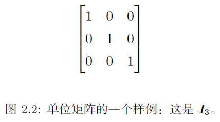

线性代数作为数学的一个分支，广泛应用于机器学习和深度学习的一些模型中，例如矩阵分解模型和各种神经网络模型等等。

## 标量、向量、矩阵和张量

学习线性代数，会涉及以下几类数学概念：

- **标量**（scaler）：一个标量就是一个单独的数；
- **向量**（vector）：一个向量是一列有序排列的数；
- **矩阵**（matrix）：一个二维数组，其中的每一个元素被两个索引所确定；
- **张量**（tensor）：可以理解为超过两维的数组。

矩阵的**转置**是以对角线为轴的镜像，通常将矩阵 $\boldsymbol{A}$ 的转置表示为 $\boldsymbol{A}^{\top}$ ，定义如下：
$$
\left(\boldsymbol{A}^{\top}\right)_{i, j}=\boldsymbol{A}_{j, i}
$$
同理，对于一个列向量，其对应的转置就是只有一行的矩阵。

**广播**是指矩阵和向量的相加，即 $\boldsymbol{C}=\boldsymbol{A}+\boldsymbol{b}$ ，此时并不需要将向量 $\boldsymbol{b}$ 复制到每一行生成一个矩阵，而是会自动与矩阵 $\boldsymbol{A}$ 的每一行相加，即满足：
$$
C_{i, j}=A_{i, j}+b_{j}
$$
矩阵和向量的乘法要区分**点积**和 **Hadamard 乘积**的区别，点积是行与列之间的相乘求和，即满足：
$$
C_{i, j}=\sum_{k} A_{i, k} B_{k, j}
$$
而 Hadamard 乘积是对应元素的相乘，通常记为 $A \odot B$ 。

常用的乘法性质：

- 分配率：$A(B+C)=A B+A C$ 
- 结合率：$A(B C)=(A B) C$ 
- 转置：$(A B)^{\top}=B^{\top} A^{\top}$ 
- 不满足交换律

## 单位矩阵和逆矩阵

**单位矩阵**即所有沿主对角线的元素都是 1 ，而所有其他位置的元素都是 0 ，通常记作 $I_{n} \in \mathbb{R}^{n \times n}$ ，如下图所示：

根据矩阵的乘法规则可知，任意向量和单位矩阵相乘都不会发生改变，即满足：
$$
\forall x \in \mathbb{R}^{n}, I_{n} x=x
$$

矩阵 $A$ 的**矩阵逆**通常记作 $A^{-1}$ ，其定义的矩阵满足如下条件：
$$
A^{-1} A=I_{n}
$$
因此对于一个线性方程组，可以通过如下的方式进行求解（**前提是一个矩阵存在对应的逆矩阵**）：
$$
\begin{align}
A x&=b \\ 
A^{-1} A x&=A^{-1} b\\ 
I_{n} x&=A^{-1} b \\ 
x&=A^{-1} b
\end{align}
$$

## 范数

在机器学习中，我们经常使用被称为 范数(norm) 的函数来衡量向量的大小。形式上，$L^p$ 范数定义如下：
$$
\|x\|_{p}=\left(\sum_{i}\left|x_{i}\right|^{p}\right)^{\frac{1}{p}}
$$
范数（包括 $L^p$ 范数）是将向量映射到非负值的函数。直观上来说，向量 $x$ 的范数衡量从原点到点 $x$ 的距离。更严格地说，范数是满足下列性质的任意函数：

- $f(x)=0 \Rightarrow x=0$
- $f(x+y) \leq f(x)+f(y)$  **三角不等式**
- $\forall \alpha \in \mathbb{R}, f(\alpha x)=|\alpha| f(x)$

机器学习中常用的范数有 $L^1$ 范数和 $L^2$ 范数，其中平方 $L^2$ 范数主要是作为正则化项来衡量模型的复杂度。但是如果我们需要严格区分恰好是零的元素和非零但值很小的元素，则通常使用 $L^1$ 范数。

> 为什么使用平方 $L^2$ 范数而不是直接的 $L^2$ 范数？
>
> 主要是平方 $L^2$ 范数的求导只与单独的元素相关，而不涉及到整体！！！

另一个经常用到的范数为 $L^{\infty}$ 范数，也称为最大范数，表示向量中具有最大幅值的元素的绝对值：
$$
\|\boldsymbol{x}\|_{\infty}=\max _{i}\left|x_{i}\right|
$$
两个向量的点积也可以用范数表示：
$$
\boldsymbol{x}^{\top} \boldsymbol{y}=\|\boldsymbol{x}\|_{2}\|\boldsymbol{y}\|_{2} \cos \theta
$$

## 特殊类型的矩阵和向量

**对角矩阵** 只在主对角线上含有非零元素，其他位置都是零，即对于任意的 $i\neq j$ ，满足 $D_{ij}=0$ 。有时会用一个向量来生成对角矩阵，记为 $diag(\boldsymbol{v})$ 。对角矩阵和向量之间的乘法计算十分简单：
$$
\operatorname{diag}(\boldsymbol{v}) \boldsymbol{x}=\boldsymbol{v} \odot \boldsymbol{x}
$$

**对称矩阵** 是转置和自己相等的矩阵，即 $A=A^{\top}$ 。

**单位向量** 是具有单位范数的向量，即满足 $\|x\|_{2}=1$ 。

**向量正交** 是指两个向量的点积为 0 ，即满足 $x^{\top} y=0$ 。如果同时每个向量都是单位向量，则称它们为 **标准正交**。

**矩阵正交** 是指行向量和列向量是分别标准正交的方阵，因此满足：
$$
A^{\top} A=A A^{\top}=I
$$
这也意味着有：$A^{-1}=A^{\top}$ 

## 特征分解

**特征分解** 即将矩阵分解成一组特征向量和特征值的过程：
$$
A \boldsymbol{v}=\lambda \boldsymbol{v}
$$
其中，非零向量 $\boldsymbol{v}$ 被称为 **特征向量**，标量 $\lambda$ 被称为对应这个特征向量的 **特征值** 。由于特征向量进行任意地缩放都会对应于同一个特征值，因此一般都只考虑**单位特征向量**。

假设矩阵 $A$ 有 $n$ 个线性无关的特征向量 $\left\{v^{(1)}, \ldots, v^{(n)}\right\}$ ，对应着特征值 $\left\{\lambda_{1}, \ldots, \lambda_{n}\right\}$ 。则我们可以将特征向量按列连接成一个矩阵，每一列都是一个特征向量：$V=\left[v^{(1)}, \ldots, v^{(n)}\right]$ ，类似地也可以将所有特征值组合成一个向量：$\boldsymbol{\lambda}=\left[\lambda_{1}, \ldots, \lambda_{n}\right]^{\top}$ 。则矩阵 $\boldsymbol{A}$ 的特征分解可以表示为：
$$
\boldsymbol{A}=V \operatorname{diag}(\boldsymbol{\lambda}) V^{-1}
$$

每个**实对称矩阵**都可以分解成实特征向量和实特征值：
$$
A=Q \Lambda Q^{\top}
$$
其中 $Q$ 是矩阵 $A$ 的特征向量组成的正交矩阵，$\Lambda$ 是对角矩阵。因为 $Q$ 是正交矩阵，我们可以将 $A$ 看作沿方
向 $\boldsymbol{v}(i)$ 延展 $\lambda_i$ 倍的空间。

> 当存在两个或多个特征向量都拥有相同的特征值时，特征分解不唯一。

**正定矩阵**：所有特征值都是正数的矩阵，满足 $x^{\top} A x=0 \Rightarrow x=0$ 。

**半正定矩阵**：所有特征值都是非负数的矩阵，满足 $x^{\top} A x \geq 0$ 

**负定矩阵**：所有特征值都是负数的矩阵；

**半负定矩阵**：所有特征值都是非正数的矩阵；

## 奇异值分解

奇异值分解是指把一个矩阵分解为奇异向量和奇异值的过程。相比于矩阵分解，奇异值分解的应用更加广泛，因为每个实数矩阵都有一个奇异值分解，但不一定都有特征分解。

对于奇异值分解，会将矩阵分解为三个矩阵的乘积，如下所示：
$$
A=U D V^{\top}
$$
假设 $A$ 是一个 $m\times n$ 的矩阵，那么 $U$ 则是一个 $m\times m$ 的矩阵，$D$ 是一个 $m\times n$ 的矩阵，$V$ 是一个 $n\times n$ 的矩阵。其中，矩阵 $U$ 和矩阵 $V$ 都定义为正交矩阵，而矩阵 $D$ 定义为对角矩阵（不一定是方阵）。

因此，对角矩阵 $D$ 对角线上的元素就被称为矩阵 $A$ 的**奇异值**，矩阵 $U$ 的列向量被称为 **左奇异值向量**，矩阵 $V$ 的列向量被称为 **右奇异值向量**。

